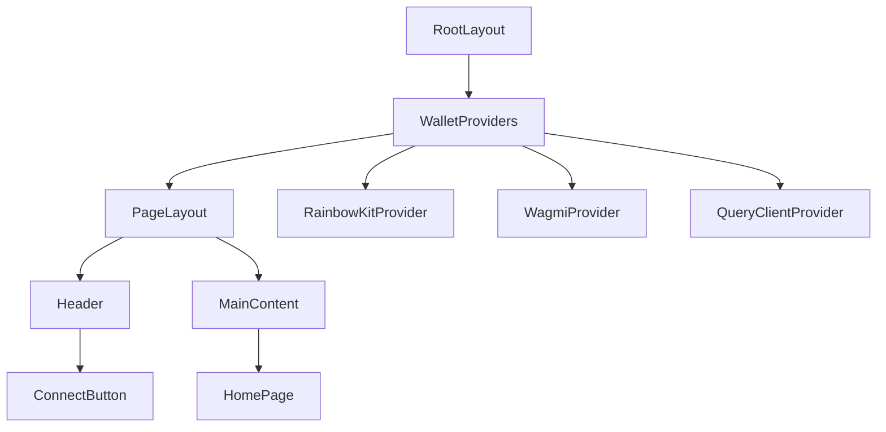
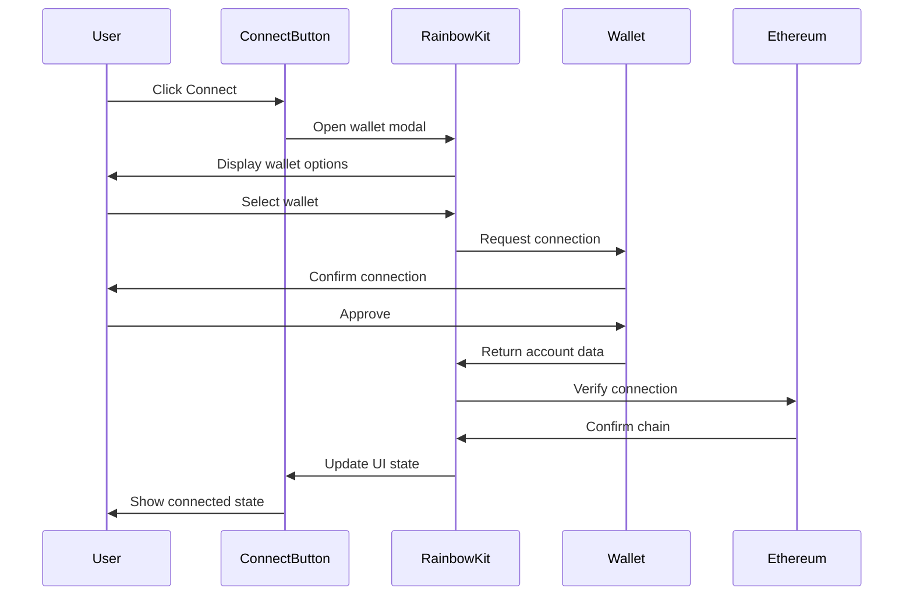

# Rainbow Kit Wallet Connection Integration

## Overview

This feature integrates web3 wallet connectivity using Rainbow Kit into the existing Next.js application. The implementation will provide users with the ability to connect various web3 wallets through a clean, user-friendly interface positioned in the top right corner of the application, while maintaining a minimal homepage design.

### Key Requirements
- Integration of Rainbow Kit for web3 wallet connectivity
- Empty/minimal start page design
- Wallet connection button positioned in top right corner
- Support for multiple wallet providers (MetaMask, WalletConnect, Coinbase Wallet, etc.)
- Responsive design compatibility

## Technology Stack & Dependencies

### Core Dependencies
- **@rainbow-me/rainbowkit**: ^2.x - Primary wallet connection library
- **wagmi**: ^2.x - React hooks for Ethereum interactions
- **viem**: ^2.x - TypeScript interface for Ethereum
- **@tanstack/react-query**: ^5.x - Data fetching and state management

### Chain Configuration
- **Ethereum Mainnet**: Primary network
- **Polygon**: Layer 2 support
- **Arbitrum**: Layer 2 support
- **Base**: Layer 2 support

## Architecture

### Component Structure



### Provider Hierarchy
1. **QueryClientProvider** - React Query configuration
2. **WagmiProvider** - Ethereum interaction hooks
3. **RainbowKitProvider** - Rainbow Kit UI components and wallet management

## Component Architecture

### WalletProviders Component
**Purpose**: Wraps the application with necessary providers for wallet functionality

**Props Interface**:
```typescript
interface WalletProvidersProps {
  children: React.ReactNode;
}
```

**Key Responsibilities**:
- Initialize React Query client
- Configure Wagmi with supported chains
- Setup Rainbow Kit theme and options
- Handle wallet connection state management

### Header Component
**Purpose**: Application header containing wallet connection interface

**Props Interface**:
```typescript
interface HeaderProps {
  className?: string;
}
```

**Layout Structure**:
- Fixed position header
- Logo/brand on the left (optional)
- Connect button positioned in top right corner
- Responsive design for mobile devices

### PageLayout Component
**Purpose**: Main layout wrapper providing consistent structure

**Props Interface**:
```typescript
interface PageLayoutProps {
  children: React.ReactNode;
}
```

**Layout Features**:
- Header integration
- Main content area
- Responsive spacing and padding

### ConnectWallet Component
**Purpose**: Custom wrapper around Rainbow Kit's ConnectButton with project-specific styling

**Props Interface**:
```typescript
interface ConnectWalletProps {
  label?: string;
  showBalance?: boolean;
  showChainIndicator?: boolean;
}
```

## Wallet Configuration

### Supported Wallets
- **MetaMask**: Browser extension wallet
- **WalletConnect**: Mobile wallet connection protocol
- **Coinbase Wallet**: Coinbase's native wallet
- **Rainbow Wallet**: Mobile-first Ethereum wallet
- **Injected Wallets**: Generic support for other browser wallets

### Chain Configuration
```typescript
const supportedChains = [
  mainnet,
  polygon,
  arbitrum,
  base
];
```

### Wallet Connection Flow


## State Management

### Connection State
- **Disconnected**: No wallet connected
- **Connecting**: Connection in progress
- **Connected**: Wallet successfully connected
- **Error**: Connection failed or network error

### User Data Management
- Account address
- ENS name (if available)
- Account balance
- Selected network/chain
- Connection status

## Styling Strategy

### Theme Configuration
- **Light Mode**: Default Rainbow Kit light theme
- **Dark Mode**: Dark theme matching application design
- **Custom Branding**: Project-specific color scheme integration

### Responsive Design
- **Desktop**: Full button with account info
- **Tablet**: Condensed button format
- **Mobile**: Icon-only or minimal text button

### Tailwind CSS Classes
- Positioning: `fixed top-4 right-4`
- Responsive spacing: `p-2 md:p-4`
- Z-index management: `z-50`

## API Integration Layer

### Wagmi Hooks Usage
- **useAccount**: Get connected account information
- **useConnect**: Handle wallet connection
- **useDisconnect**: Handle wallet disconnection
- **useNetwork**: Monitor network changes
- **useBalance**: Fetch account balance

### Chain Switching
- Automatic network detection
- User-prompted chain switching
- Fallback to default chain

## User Experience Flow

### Initial Load
1. Application loads with empty homepage
2. Header displays "Connect Wallet" button
3. No wallet-specific content shown

### Connection Process
1. User clicks connect button
2. Modal displays available wallets
3. User selects preferred wallet
4. Wallet app/extension opens
5. User approves connection
6. Button updates to show connected state

### Connected State
1. Button shows account address/ENS
2. Balance information displayed (optional)
3. Network indicator visible
4. Disconnect option available

### Error Handling
- Network connectivity issues
- Wallet rejection scenarios
- Unsupported chain detection
- Connection timeout handling

## Testing Strategy

### Unit Testing
- Component rendering tests
- Hook behavior validation
- Provider configuration tests
- Error state handling

### Integration Testing
- Wallet connection flow
- Chain switching functionality
- Provider state management
- Responsive design validation

### End-to-End Testing
- Complete user journey testing
- Cross-browser wallet compatibility
- Mobile device functionality
- Network switching scenarios

## Security Considerations

### Best Practices
- No private key handling in frontend
- Secure RPC endpoint configuration
- User consent for all transactions
- Network verification before operations

### Data Privacy
- Minimal data collection
- Local storage for preferences only
- No sensitive information logging
- User-controlled connection state